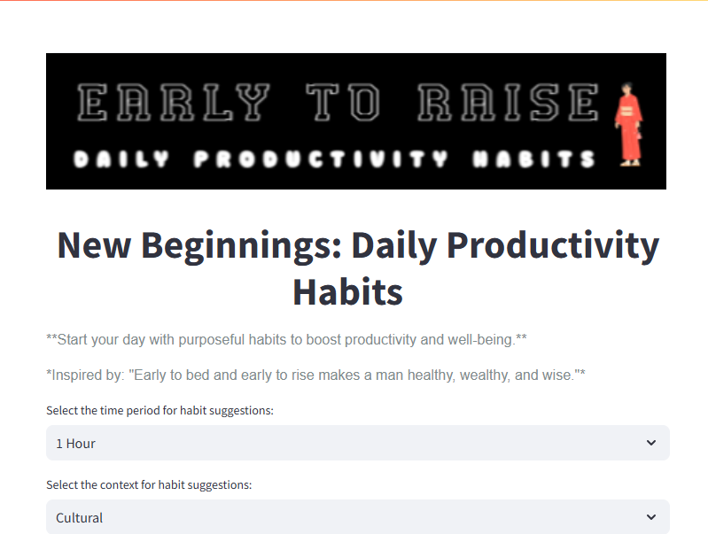

# 🌅 Early to Rise: Your Daily Productivity Habits 🌟


## 🚀 Application Demo
[](early_to_rise_app_demo.mov)

-- Music by <a href="https://pixabay.com/users/momotmusic-36971640/?utm_source=link-attribution&utm_medium=referral&utm_campaign=music&utm_content=229413">Kyrylo Momot</a> from <a href="https://pixabay.com/music//?utm_source=link-attribution&utm_medium=referral&utm_campaign=music&utm_content=229413">Pixabay</a>


**"Early to bed and early to rise makes a man healthy, wealthy, and wise."**  
**Early to Rise** is your companion for cultivating productive daily habits that are simple, effective, and tailored to your busy lifestyle.  

## 🚀 Features  

- **Personalized Habit Suggestions**: Generate daily habits to boost productivity, with each activity fitting into 5-Minutes, 15-minutes, 30-minutes and 1-hour time slots.  
- **Aligned with Your Goals**: Promotes the "Early to Rise" philosophy for a healthier, more balanced life.  
- **Minimalist Design**: Built with Streamlit for a clean and intuitive user interface.
- **Developed using Github Copilot**: Leverages OpenAI's GPT models to dynamically suggest productivity tips and habits.
- **Powered by AI**: Leverages OpenAI's GPT models to dynamically suggest productivity tips and habits.  

---

## 🛠️ Tech Stack  

- **Frontend**: [Streamlit](https://streamlit.io)  
- **Backend**: Python  
- **API Integration**: [OpenAI API](https://platform.openai.com/)  

---

## 🎯 How It Works  

1. **Start the App**: [(https://early-to-rise.streamlit.app/)](https://early-to-rise.streamlit.app/).  
2. **Generate Habits**: Click the "Generate Daily Habits" button to receive tailored suggestions for:  
   - **5-minute activity**  
   - **15-minute activity**
   - **30-minute activity**
   - **1-hour activity**  
3. **Take Action**: Commit to completing these activities and track your progress.
4. **Save the Suggesstion**: Save the suggestion as a daily challenge and make it done. 
5. **Reset**: Refresh for a new set of habits every day!  

---

## 🖥️ Local Setup  

Follow these simple steps to get started on your machine:  

1. **Clone the Repository**:  
   ```bash
   git clone [https://github.com/yourusername/rise-and-shine.git](https://github.com/mohamednizzad/early-to-rise.git)
   cd rise-and-shine
